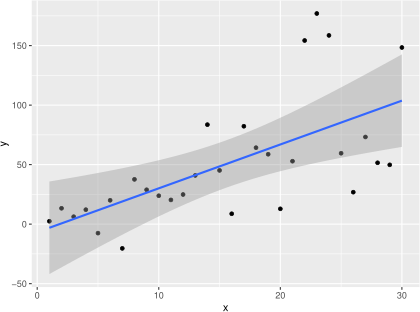
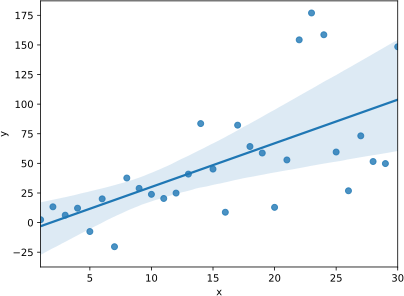

# 予測値の期待値の信頼区間

**本稿は本書の想定レベルを超えています．**

7.3.2項で次のような絵を描いています（184頁）．これは，「speedが21.5のときのdistを予測する」というのがどういうことなのかを説明するためのものです．

R|Python
:--|:--
|

直線から読み取れるのは，speedが21.5のときのdistの期待値が67になることです．しかし，直線が少し違ったものになる可能性を考慮すると，網掛け部分くらいになるかもしれません．この網掛けの部分を，予測値の期待値の**信頼区間**といいます．

実現値として得られるのは，これに誤差が加わった結果で，それを考慮したものを**予測区間**といいます．（ここでは予測区間についてはこれ以上触れません．）

本書のレベルではこれで終わりでいいのですが，上の絵の「RとPythonの網掛け部分が少し違っていること」に気付く方がいたので，少し補足します．

## 簡単な説明

Rの`ggplot2::stat_smooth`で描いた結果は，「誤差はxによらず，同一の正規分布に従う」という仮定に基づく，理論的なものです（線形**正規**回帰モデル）．

Pythonの`seaborn.regplot`で描いた結果は，そういう仮定に基づかない，シミュレーション（ブートストラップ）によるものです（線形回帰モデル）．

データが仮定に合わないと違いが際立ちます．

R|Python
:--|:--
|

## 詳しい説明

- [R側からの補足](confidence_band_R.ipynb)
- [Python側からの補足](confidence_band_python.ipynb)