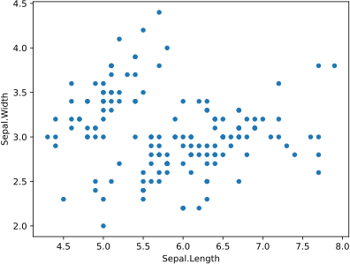
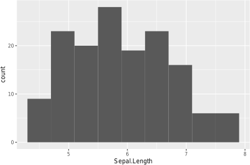
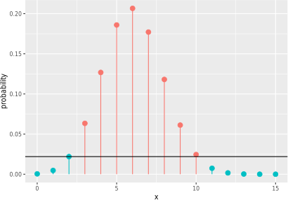
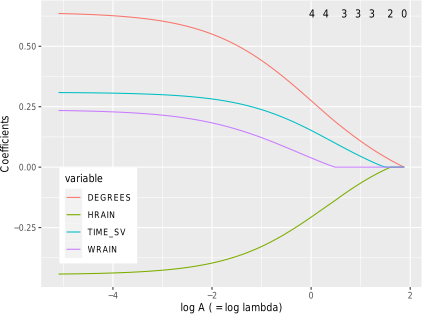
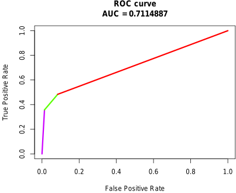

# 画像とそのソースコード

本書に掲載している画像の一覧です．
ただし，ここにあるのはドラフト段階のものです．

一部の画像は，クリックすると，それを生成するコードが表示されるようになっています．

- [はじめに](#はじめに)
- 第1部
    - [第1章 コンピュータとネットワーク](#第1章-コンピュータとネットワーク)
    - [第2章 データサイエンスのための環境](#第2章-データサイエンスのための環境)
    - [第3章 RとPython](#第3章-RとPython)
    - [第4章 統計入門](#第4章-統計入門)
    - 第5章 前処理
- 第2部
    - [第6章 機械学習の目的・データ・手法](#第6章-機械学習の目的データ手法)
    - [第7章 回帰1（単回帰）](#第7章-回帰1単回帰)
    - [第8章 回帰2（重回帰）](#第8章-回帰2重回帰)
    - [第9章 分類1（多値分類）](#第9章-分類1多値分類)
    - [第10章 分類2（2値分類）](#第10章-分類22値分類)
    - [第11章 深層学習とAutoML](#第11章-深層学習とAutoML)
    - [第12章 時系列予測](#第12章-時系列予測)
    - [第13章 教師なし学習](#第13章-教師なし学習)
- [付録A 環境構築](#付録A-環境構築)
- [おわりに](#おわりに)
- 参考文献
- 索引

参考：[ソースコードから画像をまとめて生成する方法](howtomake.md)

## はじめに

<table>
<tr><th>図1-preface</th>
  <td></td>
  <td></td>
</tr>
</table>

## 第1章 コンピュータとネットワーク

<table>
<tr><th>図1.1</th>
  <td></td>
  <td></td>
</tr>
<tr><th>図1.2</th>
  <td colspan="2"></td>
</tr>
<tr><th>図1.4</th>
  <td colspan="2"></td>
</tr>
</table>

## 第2章 データサイエンスのための環境

<table>
<tr><th>図2.1</th>
  <td></td>
  <td></td>
</tr>
<tr><th>図2.2</th>
  <td colspan="2"></td>
</tr>
<tr><th>図2.3</th>
  <td colspan="2"></td>
</tr>
<tr><th>図2.4</th>
  <td colspan="2"></td>
</tr>
<tr><th>図2.5</th>
  <td colspan="2"></td>
</tr>
<tr><th>図2.6</th>
  <td colspan="2"></td>
</tr>
<tr><th>図2.7</th>
  <td colspan="2"></td>
</tr>
<tr><th>図2.8</th>
  <td></td>
  <td></td>
</tr>
<tr><th>図2.9</th>
  <td></td>
  <td></td>
</tr>
</table>

## 第3章 RとPython

<table>
<tr><th>図3.1</th>
  <td colspan="2"></td>
</tr>
<tr><th>図3.a</th>
  <td></td>
  <td></td>
</tr>
</table>

## 第4章 統計入門

<table>
<tr><th>図4.a</th>
  <td></td>
  <td></td>
</tr>
<tr><th>図4.b</th>
  <td></td>
  <td></td>
</tr>
<tr><th>図4.c</th>
  <td></td>
  <td></td>
</tr>
<tr><th>図4.d</th>
  <td></td>
  <td></td>
</tr>
<tr><th>図4.e</th>
  <td></td>
  <td></td>
</tr>
<tr><th>図4.f</th>
  <td></td>
  <td></td>
</tr>
<tr><th>図4.g</th>
  <td></td>
  <td></td>
</tr>
<tr><th>図4.h</th>
  <td></td>
  <td></td>
</tr>
<tr><th>図4.i</th>
  <td></td>
  <td></td>
</tr>
<tr><th>図4.j</th>
  <td></td>
  <td></td>
</tr>
<tr><th>図4.k</th>
  <td></td>
  <td></td>
</tr>
<tr><th>図4.l</th>
  <td></td>
  <td></td>
</tr>
<tr><th>図4.m</th>
  <td></td>
  <td></td>
</tr>
<tr><th>図4.n</th>
  <td></td>
  <td></td>
</tr>
<tr><th>図4.o</th>
  <td></td>
  <td></td>
</tr>
<tr><th>図4.p</th>
  <td></td>
  <td></td>
</tr>
<tr><th>図4.q</th>
  <td></td>
  <td></td>
</tr>
<tr><th>図4.r</th>
  <td></td>
  <td></td>
</tr>
<tr><th>図4.s</th>
  <td></td>
  <td></td>
</tr>
<tr><th>図4.t</th>
  <td></td>
  <td></td>
</tr>
<tr><th>図4.u</th>
  <td></td>
  <td></td>
</tr>
</table>

## 第6章 機械学習の目的・データ・手法

<table>
<tr><th>図6.1</th>
  <td colspan="2"></td>
</tr>
</table>

## 第7章 回帰1（単回帰）

<table>
<tr><th>図7.a</th>
  <td></td>
  <td></td>
</tr>
<tr><th>図7.b</th>
  <td></td>
  <td></td>
</tr>
<tr><th>図7.c</th>
  <td></td>
  <td></td>
</tr>
<tr><th>図7.d</th>
  <td></td>
  <td></td>
</tr>
<tr><th>図7.e</th>
  <td></td>
  <td></td>
</tr>
<tr><th>図7.f</th>
  <td></td>
  <td></td>
</tr>
<tr><th>図7.1</th>
  <td colspan="2"></td>
</tr>
<tr><th>図7.2</th>
  <td colspan="2"></td>
</tr>
<tr><th>図7.3</th>
  <td colspan="2"></td>
</tr>
<tr><th>図7.g</th>
  <td></td>
  <td></td>
</tr>
<tr><th>図7.h</th>
  <td></td>
  <td></td>
</tr>
<tr><th>図7.i</th>
  <td></td>
  <td></td>
</tr>
</table>

## 第8章 回帰2（重回帰）

<table>
<tr><th>図8.0</th>
  <td></td>
  <td></td>
</tr>
<tr><th>図8.a</th>
  <td></td>
  <td></td>
</tr>
<tr><th>図8.b</th>
  <td></td>
  <td></td>
</tr>
<tr><th>図8.c</th>
  <td></td>
  <td></td>
</tr>
<tr><th>図8.d</th>
  <td></td>
  <td></td>
</tr>
<tr><th>図8.e</th>
  <td></td>
  <td></td>
</tr>
<tr><th>図8.1</th>
  <td colspan="2"></td>
</tr>
<tr><th>図8.2</th>
  <td colspan="2"></td>
</tr>
</table>

## 第9章 分類1（多値分類）

<table>
<tr><th>図9.a</th>
  <td></td>
  <td></td>
</tr>
<tr><th>図9.b</th>
  <td></td>
  <td></td>
</tr>
<tr><th>図9.c</th>
  <td></td>
  <td></td>
</tr>
</table>

## 第10章 分類2（2値分類）

<table>
<tr><th>図10.1</th>
  <td colspan="2"></td>
</tr>
<tr><th>図10.2</th>
  <td colspan="2"></td>
</tr>
<tr><th>図10.a</th>
  <td></td>
  <td></td>
</tr>
<tr><th>図10.b</th>
  <td></td>
  <td></td>
</tr>
<tr><th>図10.c</th>
  <td></td>
  <td></td>
</tr>
<tr><th>図10.d</th>
  <td></td>
  <td></td>
</tr>
<tr><th>図10.e</th>
  <td></td>
  <td></td>
</tr>
<tr><th>図10.e</th>
  <td></td>
  <td></td>
</tr>
<tr><th>図10.e</th>
  <td></td>
  <td></td>
</tr>
<tr><th>図10.f</th>
  <td></td>
  <td></td>
</tr>
</table>

## 第11章 深層学習とAutoML

<table>
<tr><th>図11.1</th>
  <td colspan="2"></td>
</tr>
<tr><th>図11.a</th>
  <td></td>
  <td></td>
</tr>
<tr><th>図11.b</th>
  <td></td>
  <td></td>
</tr>
<tr><th>図11.2</th>
  <td colspan="2"></td>
</tr>
<tr><th>図11.c</th>
  <td></td>
  <td></td>
</tr>
<tr><th>表11.b</th>
  <td colspan="2"></td>
</tr>
<tr><th>図11.d</th>
  <td></td>
  <td></td>
</tr>
<tr><th>図11.e</th>
  <td></td>
  <td></td>
</tr>
<tr><th>図11.3</th>
  <td colspan="2"></td>
</tr>
<tr><th>図11.4</th>
  <td colspan="2"></td>
</tr>
<tr><th>図11.f</th>
  <td></td>
  <td></td>
</tr>
<tr><th>図11.g</th>
  <td></td>
  <td></td>
</tr>
<tr><th>図11.h</th>
  <td></td>
  <td></td>
</tr>
<tr><th>図11.5</th>
  <td colspan="2"></td>
</tr>
<tr><th>図11.i</th>
  <td></td>
  <td></td>
</tr>
</table>

## 第12章 時系列予測

<table>
<tr><th>図12.a</th>
  <td></td>
  <td></td>
</tr>
<tr><th>図12.b</th>
  <td></td>
  <td></td>
</tr>
<tr><th>図12.c</th>
  <td></td>
  <td></td>
</tr>
<tr><th>図12.d</th>
  <td></td>
  <td></td>
</tr>
</table>

## 第13章 教師なし学習

<table>
<tr><th>図13.a</th>
  <td></td>
  <td></td>
</tr>
<tr><th>図13.b</th>
  <td></td>
  <td></td>
</tr>
<tr><th>図13.c</th>
  <td></td>
  <td></td>
</tr>
<tr><th>図13.d</th>
  <td></td>
  <td></td>
</tr>
<tr><th>図13.e</th>
  <td></td>
  <td></td>
</tr>
<tr><th>図13.f</th>
  <td></td>
  <td></td>
</tr>
<tr><th>図13.g</th>
  <td></td>
  <td></td>
</tr>
</table>

## 付録A 環境構築

<table>
<tr><th>図A.1</th>
  <td colspan="2"></td>
</tr>
</table>

## おわりに

<table>
<tr><th>図1-last</th>
  <td colspan="2"></td>
</tr>
</table>
