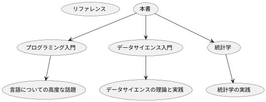

```puml
@startuml
scale 0.8
skinparam {
  defaultFontName Hiragino Kaku Gothic ProN
  monochrome true
  shadowing false
}

(リファレンス)
(本書)-->(プログラミング入門)
(本書)-->(データサイエンス入門)
(本書)-->(統計学)
プログラミング入門-->(言語についての高度な話題)
データサイエンス入門-->(データサイエンスの理論と実践)
統計学-->(統計学の実践)
@enduml
```
