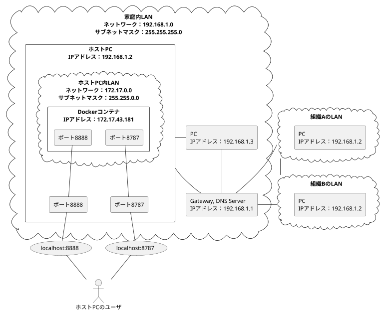

```puml
@startuml
scale 0.8
skinparam {
  defaultFontName Hiragino Kaku Gothic ProN
  monochrome true
  shadowing false
}

cloud HOMELAN as "家庭内LAN\nネットワーク：192.168.1.0\nサブネットマスク：255.255.255.0" {
  rectangle ホストPC as "ホストPC\nIPアドレス：192.168.1.2" {
    cloud ホストPC内LAN as "ホストPC内LAN\nネットワーク：172.17.0.0\nサブネットマスク：255.255.0.0" {
      rectangle コンテナ as "Dockerコンテナ\nIPアドレス：172.17.43.181" {
        rectangle コンテナ8787 as "ポート8787"
        rectangle コンテナ8888 as "ポート8888"
      }
    }
    rectangle ホスト8787 as "ポート8787"
    rectangle ホスト8888 as "ポート8888"
  }
  rectangle PC3 as "PC\nIPアドレス：192.168.1.3"
  rectangle Gateway as "Gateway, DNS Server\nIPアドレス：192.168.1.1"
  ホストPC--Gateway
  ホストPC-PC3
  PC3--Gateway
  コンテナ8787--ホスト8787
  コンテナ8888--ホスト8888
}

usecase http8787 as "localhost:8787"
usecase http8888 as "localhost:8888"

http8787-up-ホスト8787
http8888-up-ホスト8888

ホストPCのユーザ-up-http8787
ホストPCのユーザ-up-http8888

cloud 組織AのLAN {
    rectangle PC as "PC\nIPアドレス：192.168.1.2"
}

cloud 組織BのLAN {
    rectangle PC2 as "PC\nIPアドレス：192.168.1.2"
}
組織AのLAN-Gateway
組織BのLAN-Gateway
組織AのLAN--組織BのLAN

@enduml
```
