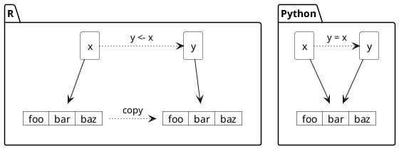

```puml
@startuml
skinparam {
  defaultFontName Hiragino Kaku Gothic ProN
  monochrome true
  shadowing false
}

package R {
rectangle y as y1 #white
rectangle x as x1 #white
rectangle list1a #white;line:white as "
  |  foo  |  bar  |  baz  |"
rectangle list1b #white;line:white as "
  |  foo  |  bar  |  baz  |"

x1 --> list1a
y1 --> list1b
x1 -[dotted]> y1 : "y <- x"
list1a -[dotted]> list1b: copy
}

package Python {
rectangle y as y2 #white
rectangle x as x2 #white
rectangle list2 #white;line:white as "
  |  foo  |  bar  |  baz  |"

x2 --> list2
y2 --> list2
x2 -[dotted]> y2 : "y = x"
}
@enduml
```
